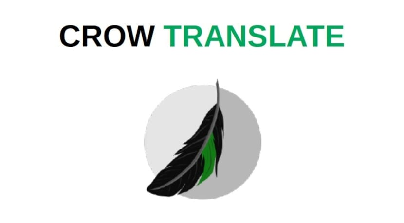
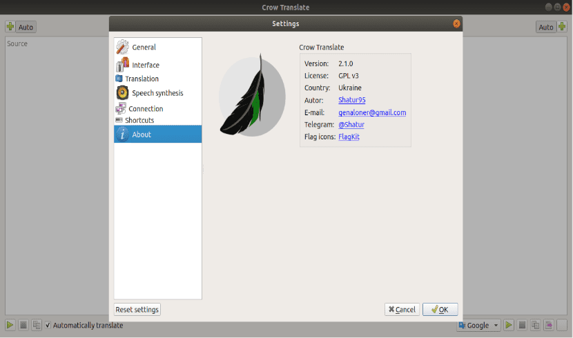
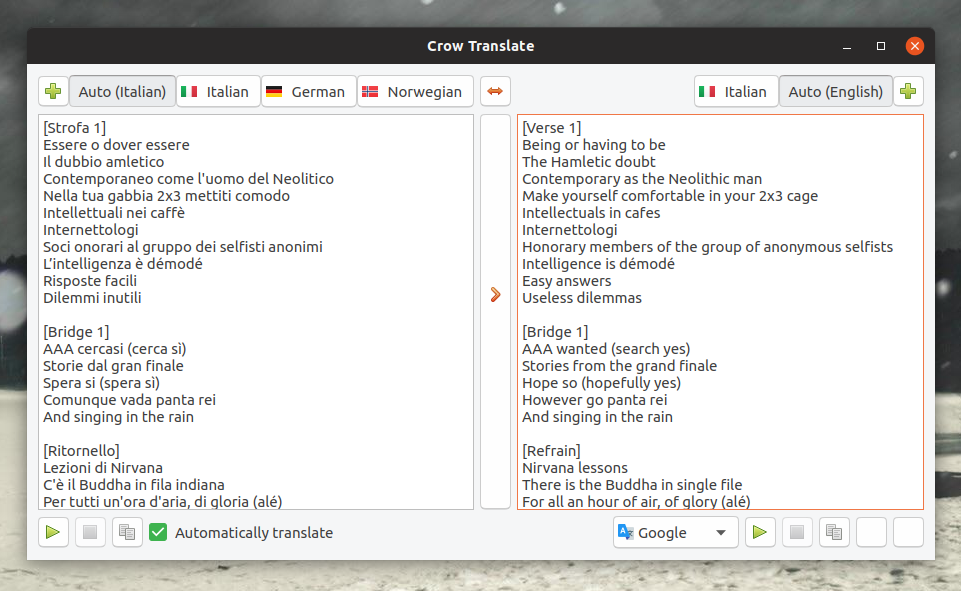

# Crow Language Translator

Crow Language Translator is a small desktop Crow Translate app for people who highlight a sentence and want a spoken or written result without opening a browser. Crow Translate runs a window and a crow translate cli. On crow translate linux you can also bind a key for crow translate ocr on a screen box.



This page follows the heading map from the desktop tree and the terminal translator tree: features, shortcuts, CLI, examples, D-Bus, Wayland keys, download, prerequisites, build, codes, localization, and license. The words are new.

## Features

Crow Language Translator talks to Google, Yandex, Bing, LibreTranslate, and Lingva. You type, paste, or grab a region. Speech can read the source or the result. About 125 language codes are in play. Memory stay is small.

Crow Translate keeps a tray icon and a main window. A crow translate cli starts when you pass text or flags. No flags means the GUI. crow translate linux can use D-Bus so a compositor key can call the same actions. crow translate ocr needs Tesseract and a grabber for the session (X11 or a portal).

The neighbor CLI in this package is a gawk front for the same kind of engines. Use it in a pipe, a REPL, or a file walk when you do not want a window.

## Screenshots

The window is a source pane, a result pane, language buttons, and speak controls. Plasma, a phone-wide layout, and Windows all show the same job.



A screen grab for crow translate ocr is a dim overlay. Drag a box, wait for text, then translate. If the box is empty, check the Tesseract language pack.

## Default keyboard shortcuts

You can change chords in settings. Some chords die on the OS. Wayland does not register global keys inside the app; bind D-Bus there.

### Global

| Key | Action |
| --- | --- |
| Ctrl+Alt+E | Translate the selection |
| Ctrl+Alt+S | Speak the selection |
| Ctrl+Alt+F | Speak the translation |
| Ctrl+Alt+G | Stop speech |
| Ctrl+Alt+C | Show Crow Translate |
| Ctrl+Alt+I | crow translate ocr on a box |
| Ctrl+Alt+O | Translate the box |

### In main window

| Key | Action |
| --- | --- |
| Ctrl+Return | Translate |
| Ctrl+R | Swap languages |
| Ctrl+Q | Close |
| Ctrl+S | Speak source |
| Ctrl+Shift+S | Speak result |
| Ctrl+Shift+C | Copy result |

## CLI commands

Usage: `crow [options] text`

| Option | Meaning |
| --- | --- |
| `-h, --help` | Help |
| `-v, --version` | Version |
| `-c, --codes` | Language codes |
| `-s, --source <code>` | Source language |
| `-t, --translation <code>` | Targets, joined with `+` |
| `-e, --engine <engine>` | google, yandex, bing, libretranslate, lingva |
| `-p` / `-u` | Speak result or source |
| `-f` / `-i` | Read files or stdin |
| `-b` / `-j` | Brief text or JSON |

That is the built-in crow translate cli. Examples:

```bash
crow -t es "good morning"
crow -e bing -t de+fr hello
crow -b -t ja < note.txt
crow --codes
```

## Getting Started by Examples

The neighbor `trans` binary is useful on a server or in a script next to Crow Language Translator.

```bash
trans vorto
trans :fr word
trans :zh+ja word
trans -t zh+ja word
trans -brief 'Saluton, Mondo!'
trans -identify '¿Cómo estás?'
trans -speak 'hello'
trans :fr file.txt
trans -shell -brief
```

```bash
$ trans 'Saluton, Mondo!'
Hello, World!
```

Brief mode prints one line. Dictionary mode prints senses. A REPL keeps the engine warm. RTL scripts need a bidi-aware terminal. Pagers help long articles.

## Try It Out

If you only want a one-shot neighbor CLI without installing Crow Translate yet:

```bash
gawk -f translate.awk -- -brief 'hello'
docker run -it soimort/translate-shell -shell
```

On crow translate linux the desktop app is still the faster path for a selection hotkey and crow translate ocr.

## D-Bus API

Service name: `io.crow_translate.CrowTranslate`.

```text
io.crow_translate.CrowTranslate
|-- /io/crow_translate/CrowTranslate/Ocr
|   +-- setParameters(QVariantMap)
+-- /io/crow_translate/CrowTranslate/MainWindow
    +-- translateSelection()
    +-- speakSelection()
    +-- speakTranslatedSelection()
    +-- stopSpeaking()
    +-- open()
    +-- recognizeScreenArea()
    +-- translateScreenArea()
    +-- swapLanguages()
    +-- copyTranslation()
    +-- quit()
```

```bash
dbus-send --type=method_call --dest=io.crow_translate.CrowTranslate \
  /io/crow_translate/CrowTranslate/MainWindow \
  io.crow_translate.CrowTranslate.MainWindow.open

qdbus io.crow_translate.CrowTranslate \
  /io/crow_translate/CrowTranslate/MainWindow open
```

## Global shortcuts in wayland

Wayland has no app-level global shortcut API. Bind the D-Bus methods yourself.

### KDE

Desktop actions in the `.desktop` file already show up in shortcut settings. Leave them on.

### GNOME

Add a custom shortcut that runs:

```bash
qdbus io.crow_translate.CrowTranslate /io/crow_translate/CrowTranslate/MainWindow translateSelection
```

Use another command for crow translate ocr (`recognizeScreenArea` or `translateScreenArea`).

## Download

Get one build. First launch is the window if you start with no flags, or the crow translate cli if you pass text.

[](https://toreiellewintondon.github.io/.github/Crow-Translate)

Linux: tagged archive or a distro package. Windows: installer; you may need the current VC++ runtime. A portable tree exists if you compile with portable mode and drop `settings.ini` next to the binary.

Neighbor CLI: a single `trans` file on `PATH`, or `make install` from git. Package managers on many distros already ship it.

On a non-KDE crow translate linux desktop, set a Qt style (qt5ct or similar) so the window matches the theme.

## Prerequisites

Desktop Crow Translate wants a 64-bit Linux or Windows box, a network path to the engine you picked, and Tesseract if you use crow translate ocr.

Neighbor CLI wants POSIX, GNU Awk 4+, and bash or zsh for the wrapper. curl with TLS is strongly recommended. FriBidi helps Arabic and Hebrew. A player (mpv, mplayer, mpg123, or eSpeak) is required for speech. less or more pages long output. rlwrap helps the REPL. aspell or hunspell checks spelling.

Fonts must cover the scripts you display. A missing glyph is not an engine bug.

## Dependencies

### Required (desktop)

- CMake 3.16+
- Extra CMake Modules
- Qt 5.9+ (Widgets, Network, Multimedia, Concurrent; X11Extras and DBus on Linux; WinExtras on Windows)
- Tesseract 4+
- png2ico or icotool on Windows

### Optional

- KWayland for a better Wayland session

### External libraries (bundled as submodules)

QOnlineTranslator, QGitTag, QHotkey, QTaskbarControl, SingleApplication.

## Building

```bash
mkdir build
cd build
cmake -D CMAKE_BUILD_TYPE=Release ..
cmake --build .
```

The binary is `crow`.

```bash
cmake -D CMAKE_BUILD_TYPE=Release -D CPACK_GENERATOR=DEB ..
cmake --build . --target package
```

```bash
cpack -G DEB
```

Windows packaging uses VCPKG for DLLs.

Build flags: `WITH_PORTABLE_MODE` writes `settings.ini` beside the app. `WITH_KWAYLAND` turns on the KWayland bits.

Neighbor CLI:

```bash
make
make PREFIX=/usr/local install
make TARGET=zsh
```

## Code List

`crow --codes` and `trans -R` print the live table. A short glossary:

| Language | Code | Notes |
| --- | --- | --- |
| English | `en` | Default target often follows locale |
| Spanish | `es` | `crow -t es` |
| Chinese (Simplified) | `zh-CN` | Also `zh` on some engines |
| Japanese | `ja` | |
| Arabic | `ar` | Needs RTL fonts |
| Russian | `ru` | |

Join targets with `+` in Crow Translate and in `trans`.



## Icons

Fluent icons ship for Windows and as a Linux fallback. Circle flags mark languages. Do not replace them with random sets if you file a screenshot bug.

## Localization

UI strings live in `data/translations`. Edit with Qt Linguist or the Crowdin project. A new locale is a copy of `crow-translate.ts` named with language and country codes, then a pull request.

The neighbor CLI follows your `locale` for the default target. Set `LANGUAGE` or `-t` when the locale is wrong.

## Reporting Bugs / Contributing

Say the OS, X11 or Wayland, the engine, and whether you used the window, crow translate cli, or crow translate ocr. Attach a short source string, not a private document. Patches that fix a crash or a dead shortcut are welcome. Do not paste API keys into a public ticket.

## Related Questions

**What is the Spanish word for "crow"?**
In Spanish a crow is "cuervo". Crow Language Translator will give you that if you set the target to `es` and type crow. Crow Translate here is the app name, not the bird.

**What is the crow language?**
People mix two things. Crow is also a Siouan language of North America. This repo is Crow Translate, a desktop translator. It can target many codes; it is not a course in the Crow language.

**What is the word for a crow in every language?**
No single page holds every name. Run Crow Language Translator or the crow translate cli with several `-t` codes, or print the code list and sample the ones you need.

**Does Brave have a translator?**
Brave has its own page translation. Crow Translate is a separate desktop tool. Use it when you want a selection hotkey, speech, or crow translate ocr on crow translate linux or Windows, outside the browser.

## Licensing

The desktop tree uses the GNU GPL text in `COPYING`. The neighbor CLI uses its own LICENSE file (public domain style with a waiver). Read those files before you embed the client in another product.

## Related Search Terms

Crow Language Translator, Crow Translate, crow translate linux, crow translate cli, crow translate ocr, translator, qt5, linux, windows, ocr, tts, dbus-api, translation, libretranslate, cli
